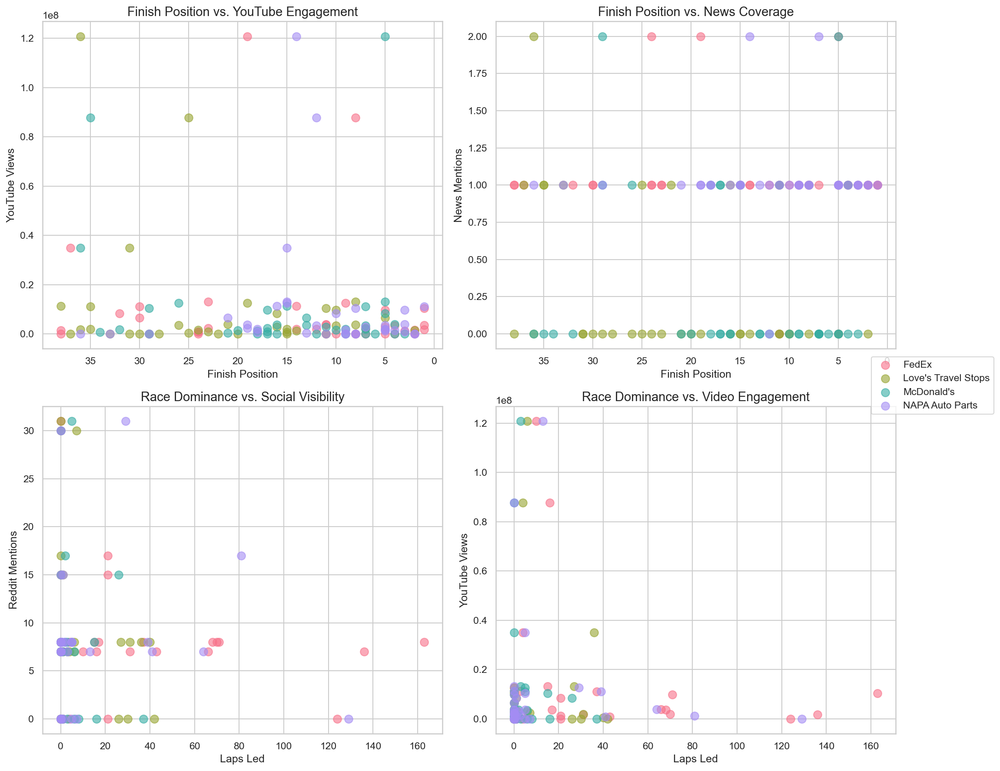
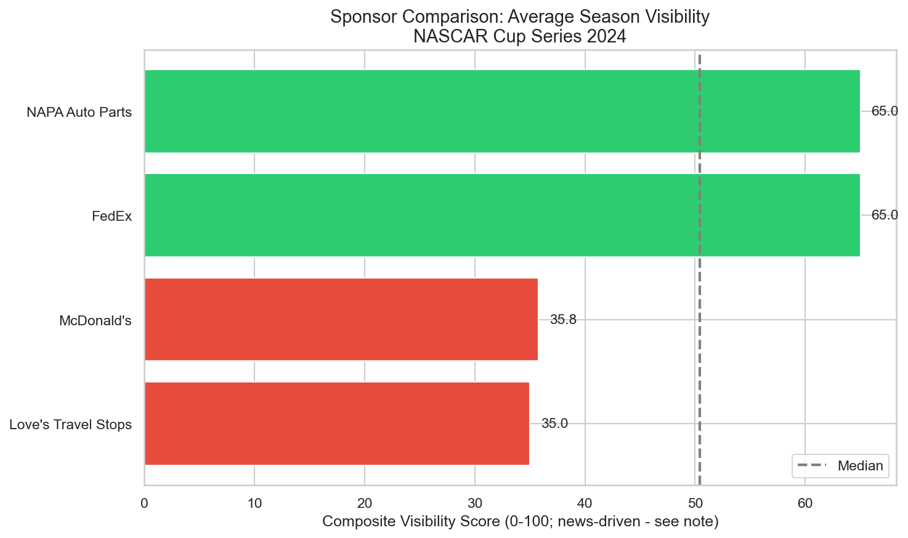
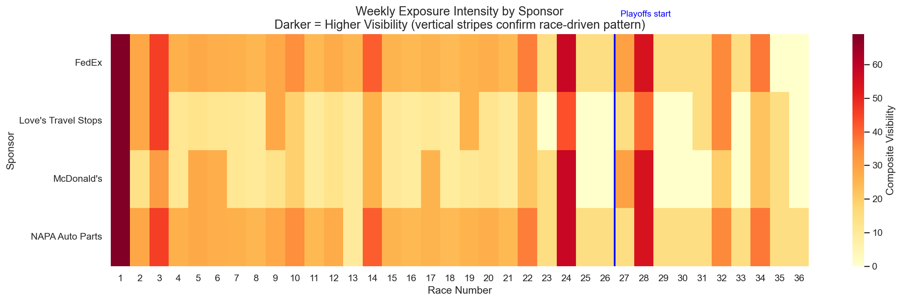
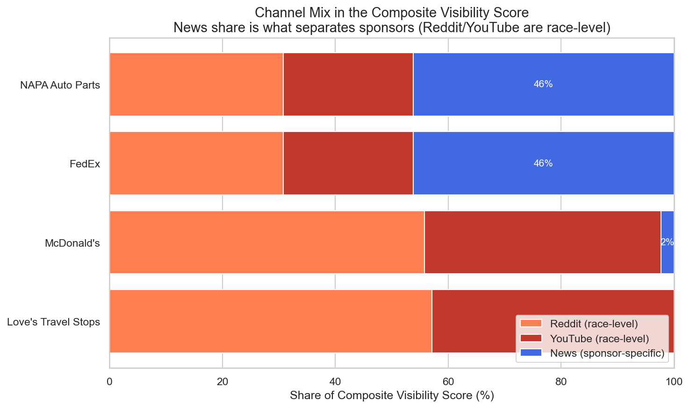

# NASCAR Sponsorship Visibility Analysis

Measuring how much brand exposure a NASCAR Cup Series sponsor gets — and testing
whether on-track performance is what drives it.

<p align="center">
  
</p>

---

## Overview

Sponsors pay for visibility, but "visibility" is rarely measured directly — it is usually
inferred from race results. This project builds a repeatable scoring model that combines race
performance, news coverage, public search interest and YouTube engagement into a single
sponsor visibility score for the 2024 Cup Series season, and then tests the assumption the
whole industry runs on: *do better finishes produce more exposure?*

In the 2024 data, mostly no: better finishes explain little of a sponsor's exposure.

> **Context.** Built as an externship for **NY Racing**, a real client, through the IE
> Master in Business Analytics & Data Science. The brief, the data, the collection code,
> the analysis and the recommendations delivered to the client are all real.

---

## Business Problem

A racing team needs to price and justify sponsorship packages. That requires answering three
questions:

1. **How much exposure does each sponsor receive**, across on-track and off-track channels?
2. **Which performance metrics drive that exposure**, so packages can be priced on evidence, not intuition?
3. **How should a composite visibility score be weighted** so it reflects real drivers of exposure?

## Objectives

- Collect sponsor exposure data from independent channels (race results, news, social, video)
- Standardise and merge them into one sponsor-race analysis dataset
- Test performance-to-visibility relationships for statistical significance
- Build a transparent, documented weighted scoring methodology
- Overlay sponsorship cost to convert exposure into value per dollar, and recommend a package
- Report what the data can and cannot support

---

## Dataset

| Source | Channel | Coverage | How collected |
|---|---|---|---|
| Kaggle — *NASCAR 2017–2024 Full Race & Points Data (Cup)* | Race performance | 2024 season, 36 points races | Downloaded, filtered to 2024 |
| Google Trends (`pytrends`) | Public search interest | Weekly, race periods | API |
| YouTube Data API | Video engagement | 2024 race videos | API |
| News mentions | Media coverage | 2024 season | Manual structured search, quality-weighted |

**Analysis dataset:** 144 observations — 4 sponsors × 36 races.
**Sponsors tracked:** FedEx (Denny Hamlin), NAPA Auto Parts, McDonald's (Bubba Wallace),
Love's Travel Stops (Michael McDowell).

> **Data note.** Reddit's public API returned HTTP 403 during collection, so Google Trends
> weekly search interest (0–100) is used as the social-buzz proxy. This is documented
> throughout, including in the column name (`Reddit_Mentions`) which was kept for continuity.
> It matters: Google Trends is a *national, race-level* signal, identical for all four
> sponsors within a race. That limitation drives the headline finding below.

---

## Approach

1. **Data collection** — Kaggle race results; Google Trends, YouTube and news collected per sponsor per race
2. **Cleaning & standardisation** — driver/sponsor name normalisation, schema alignment, documented in `outputs/project4/normalization_spec.md`
3. **Merging** — 4 sources joined into a single sponsor-race master dataset (0 missing combinations, 0 nulls)
4. **Data quality audit** — completeness, outliers and known limitations logged to `data/processed/gap_analysis.json`
5. **Exploratory analysis** — distribution and relationship review across all channels
6. **Correlation & significance testing** — Pearson correlations with p-values, pooled and per sponsor
7. **Variable selection** — relevance/independence/reliability scoring, multicollinearity screening (dropped 5 of 10 candidates)
8. **Scoring methodology** — category weights from industry frameworks, refined by the EDA findings

---

## Key Findings

**1. Only one of six performance-to-visibility relationships is statistically significant.**

| Relationship | r | p | Verdict |
|---|:---:|:---:|---|
| **Laps Led → News Mentions** | **+0.181** | **0.030** | **Weak positive, significant** |
| Finish Position → YouTube Views | +0.124 | 0.139 | Not significant (and wrong direction) |
| Finish Position → News Mentions | −0.048 | 0.567 | Negligible |
| Laps Led → YouTube Views | −0.041 | 0.626 | Negligible |
| Laps Led → Search Interest | −0.032 | 0.705 | Negligible |
| Finish Position → Search Interest | −0.024 | 0.773 | Negligible |

**2. Finish position — the metric sponsors are usually sold on — shows no significant link to
any exposure channel** in the pooled data.

**3. Leading laps, not finishing well, is what gets a driver written about.** Laps led is the
only performance metric with a significant exposure link, and it runs through news coverage —
the sparsest channel, not the social ones.

**4. The main reason is a measurable data-granularity problem, not an absence of the effect.**
Search interest and YouTube views were collected at the *race* level and are identical for all
four sponsors in a given race, so by construction they cannot explain sponsor-to-sponsor
differences. News is the only channel that varies by sponsor — and it is the only one that
produced a signal.

**5. Directions are inconsistent across sponsors.** Only Love's Travel Stops shows the expected
negative finish-to-buzz sign (r = −0.331); the other three are near zero or positive. No single
sponsor-level rule holds.

**Season baseline (2024):**

| Sponsor | Mean Finish | Laps Led | Top-5 Rate | Wins |
|---|:---:|:---:|:---:|:---:|
| NAPA Auto Parts | 11.7 | 431 | 30.6% | 1 |
| FedEx | 13.9 | 943 | 33.3% | 3 |
| McDonald's | 15.3 | 139 | 16.7% | 0 |
| Love's Travel Stops | 21.3 | 256 | 5.6% | 0 |

---

## Business Recommendations

1. **Do not price sponsorship packages on finish position alone.** The expected
   finish-to-exposure relationship is not statistically supported in this data.
2. **Weight laps led as a genuine visibility contributor** — modestly. It is the only
   performance metric with a significant exposure link, and it explains roughly 3% of variance,
   so the weight should reflect that.
3. **Treat news mentions as the most trustworthy sponsor-level exposure channel** for now. It
   is the only one that varies by sponsor.
4. **Fix the granularity problem before finalising any weights.** Re-key search and video
   metrics to the driver/sponsor level. This is the single highest-value next step; it caps how
   much any model built on the current data can be trusted.
5. **Add controls before re-testing:** playoff indicator, superspeedway/marquee-race flag, and
   a DNF/incident flag. Marquee races (Daytona, Talladega) dominate video and search volume
   regardless of how these drivers finished.

---

## Cost Efficiency: Which Sponsorship Is Worth It

The visibility score answers *how much exposure* each sponsor gets. It does not answer whether
that exposure was worth paying for. Overlaying benchmark cost estimates on the visibility
scores inverts the ranking completely.

| Sponsor | Visibility score | Visibility rank | Est. cost ($M) | Value per $M | Efficiency rank |
|---|---:|:---:|---:|---:|:---:|
| NAPA Auto Parts | 1218.8 | **1** | 21.5 | 56.7 | **4** |
| FedEx | 1215.4 | 2 | 18.5 | 65.7 | 2 |
| McDonald's | 913.6 | 3 | 14.0 | 65.3 | 3 |
| Love's Travel Stops | 698.8 | **4** | 8.5 | 82.2 | **1** |

**The most visible sponsorship is the least efficient one.** Love's Travel Stops ranks last on
raw visibility but returns **45% more value per dollar** than NAPA Auto Parts, on a Front Row
Motorsports deal roughly a quarter the price of NAPA's Hendrick package.

**Recommendation: FedEx, as the balanced option** — it captures 99.7% of the maximum exposure
available at 80% of the best efficiency in the field. Love's is the pick for pure
cost-efficiency, NAPA only if the objective is reach at any price.

The ranking is robust to how the score is weighted: across four alternative weighting
configurations no sponsor moves more than one position, and only NAPA and FedEx ever swap the
top two. Cost sensitivity was tested at low, mid and high estimates.

> **Caveat on cost.** Sponsorship fees are not public. The cost figures are benchmark estimates
> researched per sponsor and documented with confidence ratings in
> [`outputs/project4/cost_documentation.md`](outputs/project4/cost_documentation.md) — Love's
> carries the lowest confidence. The efficiency *ordering* is stable across the tested cost
> range; the absolute values are indicative.

Method and sensitivity testing: [`outputs/project4/methodology.md`](outputs/project4/methodology.md)
and [`outputs/project4/sensitivity_analysis.md`](outputs/project4/sensitivity_analysis.md).

## Deliverables

| Deliverable | File |
|---|---|
| 16-page client report | [`outputs/project5/NASCAR_Sponsorship_ROI_Report.pdf`](outputs/project5/NASCAR_Sponsorship_ROI_Report.pdf) |
| 10-slide executive deck, with speaker notes | `outputs/project5/NASCAR_Sponsorship_Presentation.pptx` |
| Per-sponsor recommendation briefs | [`outputs/project5/`](outputs/project5/) (`recommendation_fedex.md`, `_loves.md`, `_napa.md`) |
| Scenario comparison | [`outputs/project5/scenario_comparison.md`](outputs/project5/scenario_comparison.md) |

---

## Scoring Methodology

Category weights start from published sponsorship-ROI frameworks and are adjusted for what this
data can measure (activation and hospitality are unmeasurable here, so that weight is
redistributed).

| Category | Weight | Variables |
|---|:---:|---|
| Race performance | 40% | finish position (28%), laps led (12%) |
| Media coverage | 30% | news weighted mentions (30%) |
| Social engagement | 20% | search interest (10%), YouTube sponsor views (10%) |
| Special events | 10% | wins (6%), playoff races (4%) |

Full reasoning in [`outputs/project4/weighting_rationale.md`](outputs/project4/weighting_rationale.md); variable
selection and multicollinearity screening in [`outputs/project4/variable_selection.md`](outputs/project4/variable_selection.md).

---

## Technologies

| Purpose | Tools |
|---|---|
| Analysis | Python 3.11, pandas, NumPy |
| Statistics | SciPy (Pearson correlation, significance testing) |
| Data collection | PRAW, `pytrends`, YouTube Data API (`google-api-python-client`), BeautifulSoup |
| Visualisation | Matplotlib, Seaborn |
| Environment | Jupyter |

---

## Project Structure

```
├── code/
│   ├── load_kaggle_data.ipynb        # Race results ingest and 2024 filter
│   ├── clean_race_data.ipynb         # Cleaning and name standardisation
│   ├── reddit_data_collection.ipynb  # Search-interest collection (Google Trends fallback)
│   ├── youtube_data_collection.ipynb # YouTube Data API collection
│   ├── news_data_processing.ipynb    # News mention processing and quality weighting
│   ├── data_merge_master.ipynb       # Builds the 144-row master dataset
│   ├── correlation_analysis.ipynb    # Correlation matrix and significance tests
│   ├── scoring_methodology.ipynb     # Scoring design: variables, weights, normalisation
│   ├── visibility_scoring_model.ipynb # Scoring implementation and validation
│   ├── roi_efficiency_analysis.ipynb # Cost overlay, efficiency ranking, sensitivity
│   ├── strategy_recommendations.ipynb # Multi-criteria evaluation and briefs
│   ├── final_report.ipynb            # Assembles the client report
│   └── visualization_analysis.ipynb  # Figures
├── data/
│   ├── external/                     # Source Kaggle dataset
│   ├── raw/                          # Collected, unprocessed channel data
│   └── processed/                    # Cleaned, standardised, merged outputs
├── docs/                             # Methodology and findings write-ups
├── output/figures/                   # Generated charts
└── outputs/
    ├── project4/                     # Scoring config, rankings, efficiency, sensitivity
    └── project5/                     # Client report, deck, recommendation briefs
```

---

## How to Run

```bash
conda create -n nascar-visibility python=3.11 -y
conda activate nascar-visibility
pip install -r requirements.txt
```

The YouTube collection notebook needs a YouTube Data API key:

```bash
export YOUTUBE_API_KEY=your_key_here
```

Then run the notebooks in `code/` in the order listed above. **The processed data is committed**,
so `correlation_analysis.ipynb`, `scoring_methodology.ipynb` and `visualization_analysis.ipynb`
can be run directly without re-collecting anything or holding any API keys.

---

## Results

| | |
|---|---|
|  |  |
| Correlation matrix across performance and exposure metrics | Composite visibility score by sponsor |
|  |  |
| Weekly exposure intensity by sponsor across the season | Exposure split by channel |

---

## Limitations

- **Search interest and YouTube views are race-level, not sponsor-level.** This is the most
  important limitation and the direct cause of the weak correlations.
- **Reddit's API was unavailable** (HTTP 403); Google Trends interest is a proxy for social buzz,
  not a like-for-like replacement.
- **YouTube view counts were captured in 2026**, not at race time in 2024, so they reflect
  cumulative rather than contemporaneous attention.
- **News mentions were collected via structured manual search**, English-language sources only.
- **No race dates in the source data** — dates were approximated evenly across the season, so
  week-level timing is indicative rather than exact.
- **Small analysis set:** 4 sponsors × 36 races. Sponsor-level correlations rest on 36
  observations each.
- Correlation is not causation: even the significant laps-led link may reflect team strength or
  race prominence.

---

## Future Improvements

- Re-collect social and video metrics keyed to driver/sponsor rather than race
- Add playoff, superspeedway and DNF control variables and re-test within segments
- Expand beyond 4 sponsors to the full Cup field to increase statistical power
- Capture view counts at race time rather than retrospectively
- Validate the composite score against an external exposure benchmark
