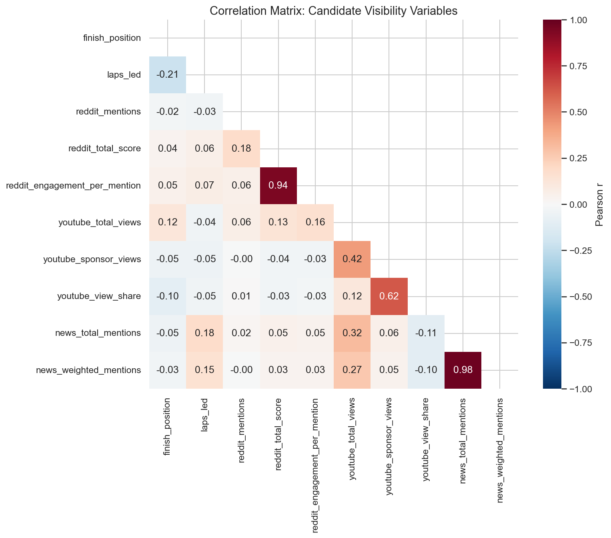
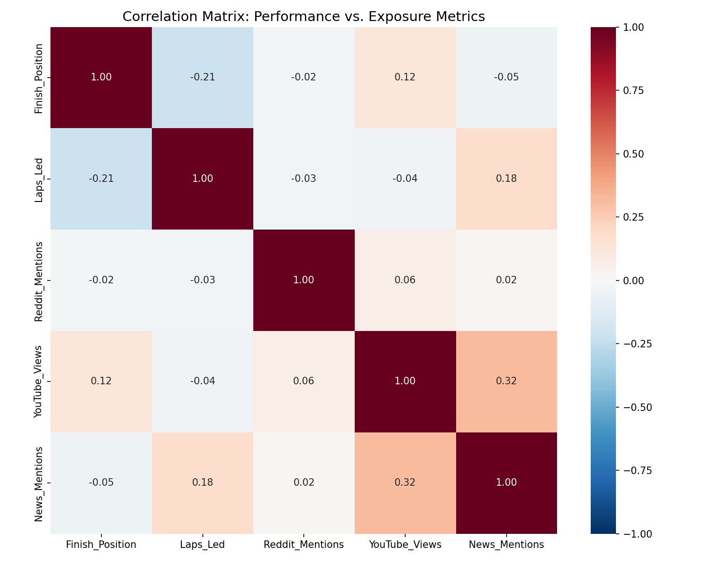
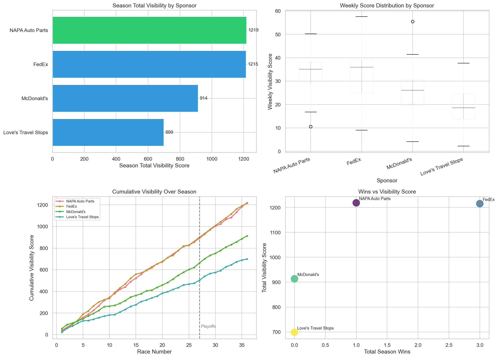
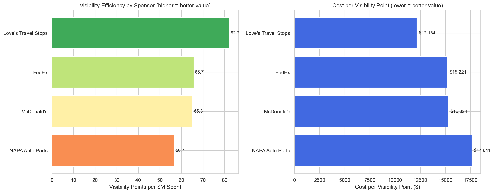
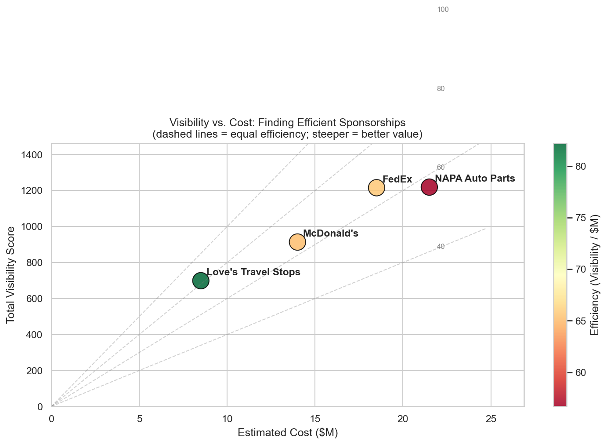
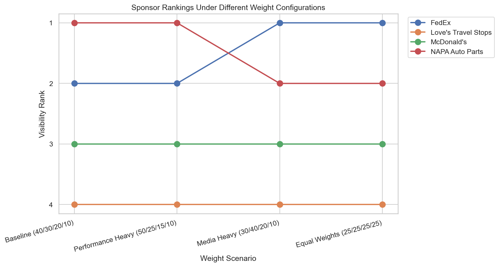
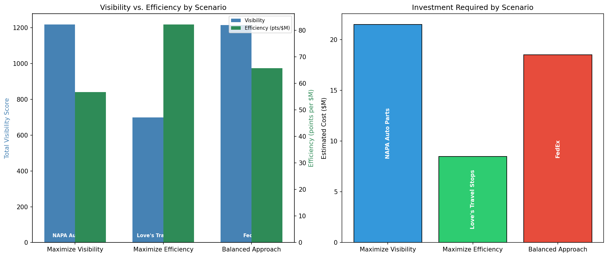

# NASCAR Sponsorship ROI Analysis
## A Visibility Scoring and Efficiency Study of the 2024 Cup Series

**Prepared for:** NY Racing  \
**Analyst:** Aylin Yasgul  \
**Scope:** 4 primary sponsors, 36 races, 144 observations

---

## Table of Contents

1. Executive Summary
2. Methodology (data sources, scoring model, validation)
3. Findings (EDA, visibility, efficiency, sensitivity)
4. Recommendations (primary, alternative, scenarios, implementation)
5. Limitations
6. Appendices (data tables, methodology details, code guide)

---

# Executive Summary

**NY Racing is evaluating NASCAR Cup Series sponsorship opportunities and needs an objective way
to compare partners.** Historically these decisions rest on relationships and intuition rather
than quantitative visibility data, so the team cannot compare opportunities fairly or identify
which partnerships deliver the best return. This analysis answers a specific question: **which
sponsors deliver the best combination of visibility and value, and which should NY Racing
prioritize?**

**Our answer: FedEx is the balanced best bet.** Across four primary sponsors and 36 races of the
2024 season, FedEx ranks #2 in both total visibility and cost efficiency, the best combined
position of any sponsor. It captures 99.7% of the maximum exposure at a materially better value
than the top-visibility option. For teams prioritizing ROI, Love's Travel Stops offers the best
value per dollar; for teams prioritizing raw exposure, NAPA Auto Parts delivers the most.

## Scope

- **Sponsors analyzed:** 4 (FedEx, NAPA Auto Parts, McDonald's, Love's Travel Stops)
- **Season:** 2024 NASCAR Cup Series, 36 races (144 sponsor-race observations)
- **Methodology:** a composite 0-100 visibility score combining race performance (40%), media
  coverage (30%), social engagement (20%), and special events (10%), divided by estimated cost
  to measure efficiency.

## Headline Findings

| Metric | Leader | Value |
|---|---|---|
| Highest visibility | NAPA Auto Parts | 1,219 points |
| Best efficiency | Love's Travel Stops | 82.2 points per $M |
| Best balance (recommended) | FedEx | #2 visibility, #2 efficiency |

1. **Efficiency flips the ranking.** The highest-visibility sponsor (NAPA) is the least efficient;
   the lowest-visibility sponsor (Love's) is the most efficient. Raw exposure and value per dollar
   point to different winners.
2. **On-track performance drives visibility only weakly in this data.** The one statistically
   significant performance-to-visibility link was laps led to news coverage (r = +0.181,
   p = 0.030); finish position showed almost no linear relationship with exposure.
3. **The rankings are robust.** Under four different weight configurations the ranking moved at
   most one position (only the top two swap), so the conclusions do not hinge on the exact weights.

## Recommendation

**FedEx** as the primary target (balanced exposure and value), with **Love's** as the value
fallback if budget tightens and **NAPA** as the premium option if maximum exposure is the goal.

## Most Important Caveat

Sponsorship costs are confidential; our figures are benchmark estimates. Efficiency rankings were
tested against low, mid, and high cost estimates and the core conclusions held. See Section 4
(Limitations) for the full discussion.

---

# 1. Methodology

## 1.1 Data Sources

The analysis draws on four data categories collected for the 2024 NASCAR Cup Series. Each was
verified for coverage and quality before use.

| Category | Source | Collection Method | Notes |
|---|---|---|---|
| Race performance | Kaggle NASCAR dataset, Racing Reference | Download + manual verification | Finish position, laps led; no missing races for tracked sponsors |
| Social (Reddit) | Google Trends proxy | Trends API | Reddit's public API returned HTTP 403, so Google Trends interest was substituted; race-level |
| Social (YouTube) | YouTube Data API | API | Sponsor-relevant video views; sparse (non-zero in 4 of 144 rows) |
| Media (news) | Manual search, tiered weighting | Search + classification | Tier 1 (ESPN, NASCAR.com) = 3, Tier 2 (regional) = 2, Tier 3 (blogs) = 1; sponsor-specific |
| Cost estimates | Forbes, Sports Business Journal, tier benchmarks | Estimates | Exact figures confidential; low / mid / high ranges recorded |

**Data quality notes.** The Kaggle race data was cross-checked against Racing Reference; sponsor
identification was added manually from team livery data. Social and news data were collected within
a consistent time window across all sponsors so the comparison is fair. The most important quality
caveat is that Reddit (a Google Trends proxy) and total YouTube views are *race-level* signals -
identical for all four sponsors within a race - and therefore cannot distinguish sponsors on their
own. Only news mentions and sponsor-specific YouTube views vary at the sponsor level.

## 1.2 Sponsor Selection

Four primary sponsors were analyzed. Selection criteria were: full-season primary sponsorship,
sufficient data across all four channels, and a deliberate mix of team tiers so the model is tested
against both elite and mid-pack operations.

| Sponsor | Team | Driver | Team Tier |
|---|---|---|---|
| FedEx | Joe Gibbs Racing | Denny Hamlin | Top |
| NAPA Auto Parts | Hendrick Motorsports | Chase Elliott | Top |
| McDonald's | 23XI Racing | Bubba Wallace | Mid-to-top |
| Love's Travel Stops | Front Row Motorsports | Michael McDowell | Mid |

---

## 1.3 Visibility Scoring Model

We built a composite visibility score that combines four categories into a single 0-100 metric.
Category weights start from industry sponsorship-ROI frameworks and are refined by the exploratory
analysis. News carries the highest single weight because it was the only sponsor-varying exposure
channel with a statistically significant link to on-track performance.

| Category | Variable | Effective Weight | Transform |
|---|---|---|---|
| Race Performance | finish_position | 28% | invert_position |
| Race Performance | laps_led | 12% | normalize |
| Media Coverage | news_weighted_mentions | 30% | normalize |
| Social Engagement | reddit_mentions | 10% | normalize |
| Social Engagement | youtube_sponsor_views | 10% | log_normalize |
| Special Events | is_win | 6% | binary |
| Special Events | is_playoff | 4% | binary |

**Normalization.** All variables are scaled to a 0-100 range with min-max normalization computed
season-wide (across all 144 rows) so every sponsor sits on one shared scale.

- Direct variables (higher is better): `score = (value - min) / (max - min) * 100`.
- Inverse variables (finish position, lower is better): `score = (max - value) / (max - min) * 100`,
  so a race win (P1) maps to 100.
- YouTube views are log-transformed (`log(x + 1)`) before normalizing to prevent a single viral
  video from dominating.
- Binary flags (wins, playoff races) scale directly to 0 or 100.
- Edge case: if every value is identical, the variable returns 50 (no differentiation possible).

**Aggregation.** The weekly visibility score is the weighted sum of the normalized variables. The
season total is the sum of the 36 weekly scores (theoretical maximum 100 x 36 = 3,600). Efficiency
is the season total divided by the estimated cost in millions of dollars.

## 1.4 Validation

The model was validated with directional checks (do the rankings match expected patterns), event
checks (do wins and playoff races spike), and anomaly detection. Every check passed.

| Check | Result | Expected | Pass |
|---|---|---|---|
| Finish position vs. total visibility | r = -0.93 | Negative (better finish, higher score) | Yes |
| Wins vs. total visibility | r = +0.76 | Positive | Yes |
| Laps led vs. total visibility | r = +0.70 | Positive | Yes |
| Win vs. non-win weekly score | 1.9x | 1.5-3x | Yes |
| Top-5 vs. bottom-20 weekly score | 2.5x | Above 1.5x | Yes |
| Anomalies (scores over 100, impossible values) | None | None | Yes |

A weight-sensitivity test across four configurations (Section 2.4) moved the ranking at most one
position, confirming the model is stable.

---

# 2. Findings

## 2.1 Exploratory Analysis

Before building the model we examined how race performance relates to the exposure channels.
Contrary to the common assumption that better results drive more buzz, the performance-to-visibility
relationship is **weak** in this dataset.

| Relationship | Correlation (r) | p-value | Significant? |
|---|---|---|---|
| Laps led vs. news mentions | +0.181 | 0.030 | Yes |
| Finish position vs. YouTube views | +0.124 | 0.139 | No |
| Finish position vs. Reddit mentions | -0.024 | 0.773 | No |

**Insight.** The single reliable performance-to-visibility link is laps led to news coverage. The
main reason finish position shows almost no relationship is that Reddit and YouTube were collected
at the race level (identical for all sponsors in a race), so they cannot separate sponsors. This is
precisely why the scoring model weights news - the only sponsor-varying exposure channel - most
heavily.

**Descriptive baseline.** The sponsors differ sharply in on-track performance, which sets up the
visibility results that follow.

| Sponsor | Mean Finish | Median | Std | Laps Led | Wins | Top-5 Rate |
|---|---|---|---|---|---|---|
| NAPA Auto Parts | 11.7 | 10 | 8.5 | 431 | 1 | 31% |
| FedEx | 13.9 | 10 | 11.6 | 943 | 3 | 33% |
| McDonald's | 15.3 | 14 | 9.6 | 139 | 0 | 17% |
| Love's Travel Stops | 21.3 | 22 | 10.4 | 256 | 0 | 6% |

## 2.2 Visibility Rankings

| Rank | Sponsor | Total Visibility | Key Driver |
|---|---|---|---|
| 1 | NAPA Auto Parts | 1,219 | Consistent top-10 finishes (most, 19); steady exposure |
| 2 | FedEx | 1,215 | Most wins (3) and laps led; boom-or-bust superspeedway peaks |
| 3 | McDonald's | 914 | Mid-pack performance |
| 4 | Love's Travel Stops | 699 | Back-of-field running; lowest news coverage |

NAPA and FedEx are effectively tied at the top - a 3-point gap on a roughly 1,200-point scale. The
dashboard below shows season totals, the spread of weekly scores, cumulative accumulation across the
season, and the relationship between wins and total visibility.

**What drove each score.** Because Reddit and total YouTube are race-level, the sponsor-level
differences in the composite come mainly from news coverage and on-track performance. The channel
mix below shows how large the news contribution is for the top two sponsors relative to the others.

## 2.3 Efficiency Analysis

Adding the cost dimension changes the picture entirely.

| Rank | Sponsor | Efficiency (pts/$M) | Est. Cost | Visibility Rank |
|---|---|---|---|---|
| 1 | Love's Travel Stops | 82.2 | $8.5M | 4 |
| 2 | FedEx | 65.7 | $18.5M | 2 |
| 3 | McDonald's | 65.3 | $14.0M | 3 |
| 4 | NAPA Auto Parts | 56.7 | $21.5M | 1 |

**Key insight.** The efficiency ranking inverts the visibility ranking. Love's, last in raw
exposure, is first in value per dollar (a cheaper Front Row deal); NAPA, first in exposure, is last
in efficiency (a premium Hendrick deal). FedEx is the only sponsor top-2 on both dimensions.

## 2.4 Sensitivity Analysis

Because both the weights and the costs are judgment calls, we tested how sensitive the rankings are
to each. Weights were varied across four configurations (baseline 40/30/20/10, performance-heavy,
media-heavy, equal). The ranking is **robust**: the maximum movement is one position, and only the
top two (NAPA and FedEx) swap. McDonald's (#3) and Love's (#4) never move. Efficiency ranks were
also stable across low, mid, and high cost estimates.

---

# 3. Recommendations

## 3.1 Primary Recommendation: FedEx

**FedEx represents the best-balanced sponsorship opportunity for NY Racing.**

- **Only sponsor top-2 on both dimensions** (visibility #2, efficiency #2), minimizing the trade-off
  between exposure and value.
- **Best on-track performance:** 3 wins and 12 top-5 finishes, the most wins of any sponsor.
- **Near-max exposure at a lower price:** 99.7% of the top sponsor's visibility at about 14% lower
  cost ($18.5M vs $21.5M).

Key metrics: visibility 1,215 (rank #2), efficiency 65.7 pts/$M (rank #2), estimated cost $18.5M.
Risks: higher weekly volatility (boom-or-bust superspeedway results) and a top-tier price. Mitigation:
frame expectations around season totals, and use the efficiency story to justify the spend.

## 3.2 Alternative: Love's Travel Stops (Value)

Best for teams prioritizing ROI. Love's is #1 in efficiency (82.2 pts/$M) at the lowest cost
($8.5M), with low week-to-week volatility. Trade-off: the lowest absolute visibility (rank #4).
Choose it when budget is constrained or an ROI justification is critical, and position it as an
efficient entry point rather than a headline play.

## 3.3 Strategic Scenarios

The choice ultimately depends on NY Racing's priorities. Three distinct strategies each point to a
different sponsor.

| Scenario | Recommended Sponsor | Visibility | Efficiency | Cost | Best For |
|---|---|---|---|---|---|
| A. Maximize Visibility | NAPA Auto Parts | 1,219 (#1) | 56.7 (#4) | $21.5M | Brand awareness |
| B. Maximize Efficiency | Love's Travel Stops | 699 (#4) | 82.2 (#1) | $8.5M | ROI / budget |
| C. Balanced (recommended) | FedEx | 1,215 (#2) | 65.7 (#2) | $18.5M | Mixed priorities |

## 3.4 Implementation Guidance

1. **Immediate:** confirm the actual FedEx deal cost and contract expiry (the negotiation window).
2. **Short-term (1-2 weeks):** assess brand alignment between FedEx and NY Racing's target audience.
3. **Medium-term (1 month):** validate the recommendation with multi-season data before a final
   commitment, and evaluate activation value (hospitality, B2B) that this analysis does not capture.

## 3.5 Reusable Decision Framework

This methodology can be reapplied to evaluate future sponsorship opportunities.

| Step | Action | Deliverable |
|---|---|---|
| 1 | Collect race performance data | Race results dataset |
| 2 | Gather social and media exposure | Social + media data |
| 3 | Calculate the normalized composite visibility score | Scored dataset |
| 4 | Research cost estimates | Cost range table |
| 5 | Compute efficiency (visibility per dollar) | Efficiency rankings |
| 6 | Run weight and cost sensitivity tests | Stability assessment |
| 7 | Make a recommendation with documented rationale | Decision document |

---

# 4. Limitations

Transparency about what the analysis cannot tell you is what separates a credible study from a
marketing claim. Five limitations are material.

| # | Limitation | Impact | Mitigation |
|---|---|---|---|
| 1 | Cost estimates are confidential approximations | Efficiency ranks could shift if actual costs differ | Tested low / mid / high cost estimates; conclusions held |
| 2 | Reddit is a Google Trends proxy and, with total YouTube views, is race-level | Those channels do not differentiate sponsors in the ranking | News (sponsor-specific) carries the sponsor-level signal and gets the highest weight |
| 3 | Sponsor-specific YouTube views are non-zero in only 4 of 144 rows | The 10% YouTube weight contributes little in practice | Flagged for re-collection at the sponsor level |
| 4 | Single 2024 season | May not generalize to future seasons | Framed conclusions as 2024-specific; recommended multi-season validation |
| 5 | Activation (hospitality, B2B) not measured | Captures visibility, not total sponsorship ROI | Scope stated clearly as visibility, not full ROI |

**What this analysis CAN tell you:** relative visibility rankings of the analyzed sponsors, which
sponsors deliver the most visibility per estimated dollar, how race performance relates to
visibility, and which events generate the most exposure.

**What it CANNOT tell you:** whether a sponsorship is a good business decision overall, the actual
(confidential) sponsorship costs, whether past visibility predicts future results, or how visibility
converts to sales.

---

# Appendices

## Appendix A: Full Data Tables

### A.1 Combined Rankings

| Sponsor | Total Visibility | Vis Rank | Efficiency (pts/$M) | Eff Rank | Est. Cost |
|---|---|---|---|---|---|
| NAPA Auto Parts | 1219 | 1 | 56.7 | 4 | $21.5M |
| FedEx | 1215 | 2 | 65.7 | 2 | $18.5M |
| McDonald's | 914 | 3 | 65.3 | 3 | $14.0M |
| Love's Travel Stops | 699 | 4 | 82.2 | 1 | $8.5M |

### A.2 Descriptive Statistics by Sponsor

| Sponsor | Mean Finish | Median | Std | Best | Worst | Laps Led | Wins | Top-5 Rate |
|---|---|---|---|---|---|---|---|---|
| NAPA Auto Parts | 11.7 | 10 | 8.5 | 1 | 36 | 431 | 1 | 31% |
| FedEx | 13.9 | 10 | 11.6 | 1 | 38 | 943 | 3 | 33% |
| McDonald's | 15.3 | 14 | 9.6 | 3 | 36 | 139 | 0 | 17% |
| Love's Travel Stops | 21.3 | 22 | 10.4 | 2 | 38 | 256 | 0 | 6% |

### A.3 Cost Estimates (benchmark-based; confidential deals)

| Sponsor | Team | Tier | Low | Mid | High | Confidence |
|---|---|---|---|---|---|---|
| NAPA Auto Parts | Hendrick Motorsports | top | $18M | $21.5M | $25M | medium |
| FedEx | Joe Gibbs Racing | top | $15M | $18.5M | $22M | medium-high |
| McDonald's | 23XI Racing | mid-to-top | $10M | $14.0M | $18M | medium |
| Love's Travel Stops | Front Row Motorsports | mid | $5M | $8.5M | $12M | low-medium |

### A.4 Multi-Criteria Evaluation (0-100 scores)

Recommendation score = 0.4 visibility + 0.4 efficiency + 0.2 consistency.

| Sponsor | Visibility Score | Efficiency Score | Consistency Score | Rec Score |
|---|---|---|---|---|
| NAPA Auto Parts | 100 | 25 | 93 | 68.5 |
| FedEx | 75 | 75 | 0 | 60.0 |
| McDonald's | 50 | 50 | 53 | 50.5 |
| Love's Travel Stops | 25 | 100 | 100 | 70.0 |

## Appendix B: Methodology Details

### B.1 Scoring Configuration

| Variable | Category | Weight in Category | Effective Weight | Direction | Transform |
|---|---|---|---|---|---|
| finish_position | Race Performance | 70% | 28% | inverse | invert_position |
| laps_led | Race Performance | 30% | 12% | direct | normalize |
| news_weighted_mentions | Media Coverage | 100% | 30% | direct | normalize |
| reddit_mentions | Social Engagement | 50% | 10% | direct | normalize |
| youtube_sponsor_views | Social Engagement | 50% | 10% | direct | log_normalize |
| is_win | Special Events | 60% | 6% | direct | binary |
| is_playoff | Special Events | 40% | 4% | direct | binary |

### B.2 Variable Selection Decision

Seven variables were selected from ten candidates on three tests (relevance, independence,
reliability). Five were excluded.

**Selected:** finish_position, laps_led (performance); news_weighted_mentions (media);
reddit_mentions, youtube_sponsor_views (social); is_win, is_playoff (special events).

**Excluded and why:** reddit_total_score and reddit_engagement_per_mention (sparse, 9 of 144
rows; redundant, r = 0.94); youtube_total_views (race-level, not sponsor-specific);
youtube_view_share (derivative and sparse); news_total_mentions (redundant with weighted news,
r = 0.98).

### B.3 Weighting Rationale

Category weights (Race Performance 40%, Media 30%, Social 20%, Special Events 10%) come from
industry sponsorship-ROI frameworks (on-field performance 30-40%, media 25-35%, social 20-30%,
activation 10-20%), with the unmeasurable activation weight redistributed. The split was then
refined by the exploratory analysis: news receives the highest single variable weight (30%)
because it was the only sponsor-varying channel that produced a statistically significant link to
performance. Finish position is weighted highest within performance on industry grounds, with the
open caveat (Section 4) that its observed correlation with exposure was weak in this dataset.

## Appendix C: Code Repository Guide

All analysis is reproducible in the project repository.

| File / Folder | Purpose |
|---|---|
| `code/clean_race_data.ipynb`, `code/data_merge_master.ipynb` | Data cleaning and merge (Project 2) |
| `code/correlation_analysis.ipynb` | Correlation analysis (Project 3.1) |
| `code/visualization_analysis.ipynb` | EDA and visualizations (Project 3.2) |
| `code/scoring_methodology.ipynb` | Variable selection, weighting, normalization design (Project 4.1) |
| `code/visibility_scoring_model.ipynb` | Scoring model implementation and validation (Project 4.2) |
| `code/roi_efficiency_analysis.ipynb` | Cost research and efficiency analysis (Project 4.3) |
| `code/strategy_recommendations.ipynb` | Recommendation briefs and scenarios (Project 5.1) |
| `code/final_report.ipynb` | This report assembly (Project 5.2) |
| `outputs/project4/`, `outputs/project5/` | Generated results, tables, and charts |

*End of report. Prepared by Aylin Yasgul for NY Racing. Based on 2024 season data.*

---
